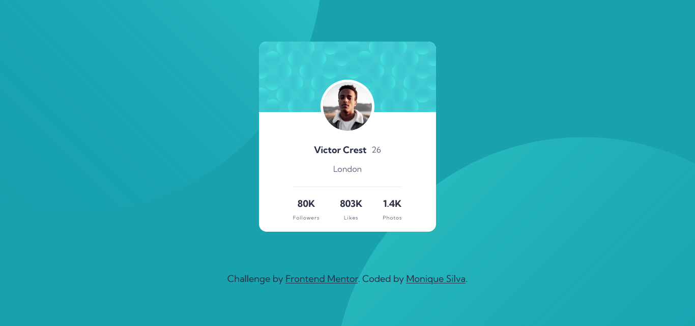

# Frontend Mentor - Profile card component solution

This is a solution to the [Profile card component challenge on Frontend Mentor](https://www.frontendmentor.io/challenges/profile-card-component-cfArpWshJ). Frontend Mentor challenges help you improve your coding skills by building realistic projects.

## Table of contents

- [Overview](#overview)
  - [The challenge](#the-challenge)
  - [Screenshot](#screenshot)
  - [Links](#links)
- [My process](#my-process)
  - [Built with](#built-with)
  - [What I learned](#what-i-learned)
- [Author](#author)

## Overview

### The challenge

- Build out the project to the designs provided

### Screenshot

### Links

- [Solution URL](https://moniquedsilva.github.io/profile-card-component/)
- [Live Site URL](https://your-live-site-url.com)

## My process

### Built with

- Semantic HTML5 markup
- CSS custom properties
- Flexbox
- Mobile-first workflow
- [Vue](https://v3.vuejs.org/) - JS library

### What I learned

This is my first frontendmentor project and my first project built with Vue. I'm aiming to learn Vue and this project was great for improving my skills as well as build out the project without having figma design to lookup. So it was challenging and it took me a while to understand how much spacing and size i needed to use to complete this task.

## Author

- Linkedin - [Monique Santos](https://www.linkedin.com/in/moniquesilva95/)
- Frontend Mentor - [@moniquedsilva](https://www.frontendmentor.io/profile/moniquedsilva)
- Twitter - [@moniquesdsilva](https://twitter.com/moniquesdsilva)
